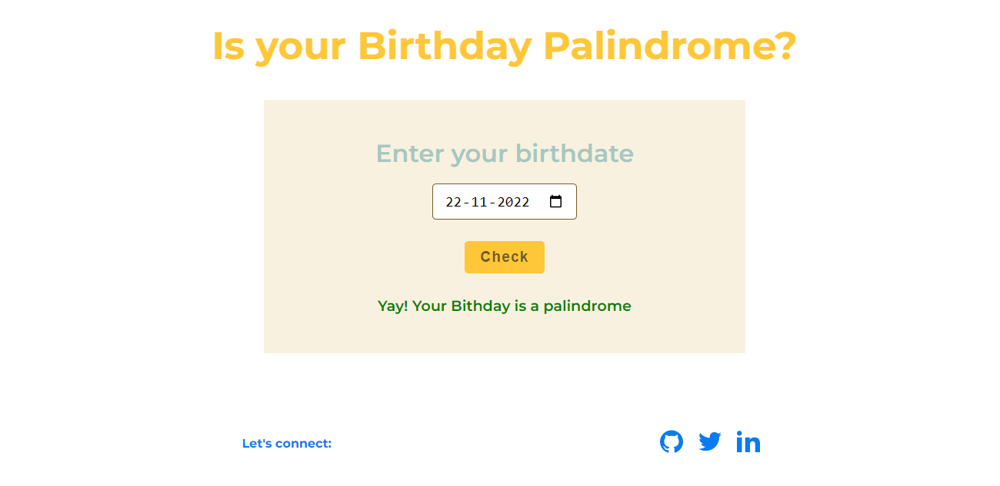

# Check Palindrome Birthday

## Mark 13
This app was made to check whether the given birthdate is palindrome or not if yes it shows that or else it examines the past and future dated to find out the closest palindrome date from the given birthdate.

### The process involved

1. convert the given date to all date formats like dd-mm--yyyy, mm-dd-yyyy, yyyy-mm-dd, dd-mm-yy, mm-dd-yy, yy-mm-dd.
2. Reverse the given dates
3. check if reverse date is equal to given date
4. If yes return that else find the nearest date using loop from past and future 
5. And show the closest one from the given birthdate 

